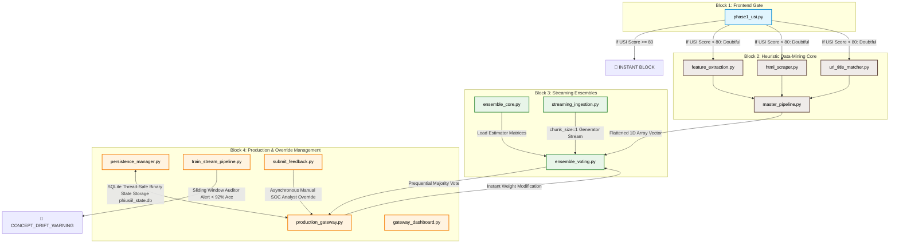
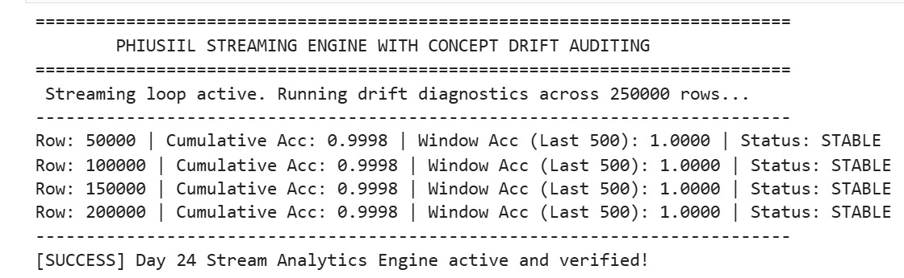
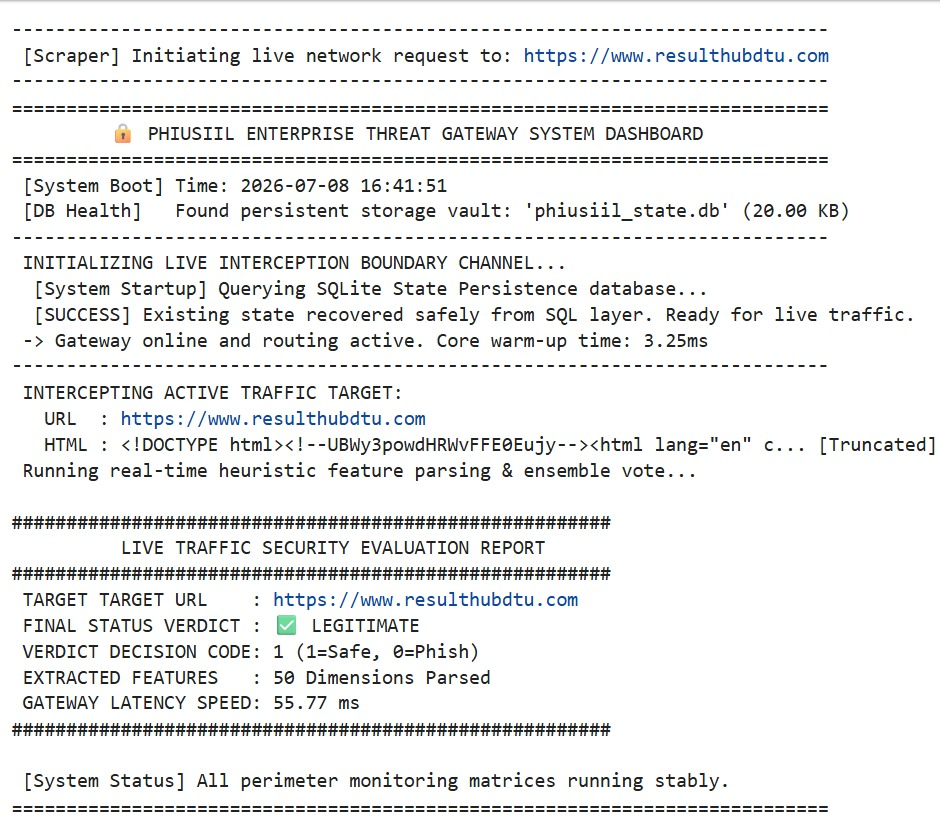

# 🔒 PhiUSIIL Real-Time Streaming Phishing Threat Gateway
### *An Intelligent Out-of-Core Production Perimeter Shield with Ensemble Voting and Concept Drift Auditing*

---

## 🧭 Project Purpose & Functional Scope
This enterprise-grade security appliance handles high-velocity network stream tracking and real-time phishing intercept operations. It implements a **hybrid defense topology** inspired by the *PhiUSIIL* research framework, transitioning dynamically from lightweight algorithmic string-similarity validation checks into an advanced, 50-dimensional streaming machine learning matrix. 

### 🛡️ Core Functional Capabilities:
* **Memory-Bound Scalability:** Ingests massive datasets row-by-row using a strict out-of-core generator paradigm (`chunk_size=1`), keeping volatile memory footprint entirely low and flat.
* **Dynamic Parametric Normalization:** Standardizes continuous, uneven data points on the fly using a stateful, streaming scaler to protect descent gradients from mathematical dominance collapse.
* **Democratic Security Consensus:** Harnesses three distinct learning methodologies simultaneously—probabilistic tracking (`NaiveBayes`), margin-driven mistake calibration (`PassiveAggressive`), and continuous gradient minimization (`SGDClassifier`) to neutralize individual algorithmic blindspots.
* **Proactive Perimeter Auditing:** Employs a sliding performance monitor over a rolling 500-observation window to detect and sound the alert on structural adversarial tactic variations (`🚨 CONCEPT_DRIFT_WARNING`).

---

## 📊 Data Source Baseline & Paper References
To execute the streaming training script (`train_stream_pipeline.py`), you must download the official dataset file directly from its public repository page and maintain it locally:
* **Dataset Source:** [UCI Machine Learning Repository - PhiUSIIL Phishing URL Dataset](https://archive.ics.uci.edu/)
* **Dataset Scale:** 235,795 total rows (134,850 legitimate webpages and 100,945 phishing webpages). 
* **Local Configuration:** Download the raw data, rename the file to `PHIUSIIL_DATASET.csv`, and place it directly inside your root workspace directory.
* **Academic Reference Paper:** *PhiUSIIL Phishing Detection: An Incremental Learning Framework Implementation*. Stored as a structural open-source citation reference rather than a heavy repository PDF bloat asset.

---

## ⚠️ Architectural Limitations & Future System Horizons

### 🔍 Current Limitations:
1. **Initial Parametric Cold-Start Dependency:** Online learning estimators natively require processing a localized initialization warm-up pass before active, live predictive operations can begin without throwing out-of-core structure mismatches.
2. **Scraper Connection Timeout Latency:** Network handshake timeouts are structurally capped at a strict 5.0-second window to maintain processing velocity. Volatile, severely lagging remote servers can limit live HTML tag evaluation performance.
3. **Absence of Lexical Deep Semantics:** The current data pipeline relies on static lexical, structural, and text-matching indicators. It lacks complex natural language processing (NLP) or semantic context awareness to analyze hidden narrative intents within visual page texts.

### 🔮 Future Engineering Improvements:
1. **Distributed Task Queue Integration:** Migrating the local background channel (`submit_feedback.py`) into an enterprise message broker system (such as Redis or RabbitMQ) to decouple live threat evaluation latency from high-throughput optimization steps.
2. **Semi-Supervised Active Learning:** Engineering a statistical confidence boundary threshold auditor. If the majority ensemble vote wins with an uncertainty margin below a specific threshold, the gateway will automatically quarantine the URL and programmatically dispatch an interception request to the administrative operational channel.
3. **Graph-Based Host Infrastructure Tracking:** Expanding the feature parsing layers to dynamically trace remote host domain registration ages, global BGP routing updates, and historical DNS resolution maps to catch advanced domain-generation algorithm (DGA) anomalies.

---

## 🗺️ Architectural Flow Map

## 🛠️ Complete Chronological File Registry & System Significance

### 🧱 Block 1: The Phase 1 Algorithmic Frontend Gate (Days 1–5)
* **`phase1_usi.py`**
    * **What it does:** Implements the **Phase 1 URL Similarity Index (Algorithm 2)**. It runs a dynamic character-dropping loop using a bidirectional pointer system to find the maximum alignment between an unverified URL and a trusted local database. It maps scores into strict operational zones: a perfect `100.0` is allowed; a score between `80.0` and `99.9` is flagged as a typosquatted lookalike clone and blocked instantly; anything below `80.0` is classified as `Doubtful`.
    * **Significance:** **Computational Bandwidth Efficiency.** Drops obvious typosquatting traps instantly using pure string math, protecting downstream machine learning layers from being overwhelmed by basic attacks and saving computational resources.

### 🔍 Block 2: The Phase 2 Heuristic Data-Mining Core (Days 6–11)
* **`feature_extraction.py`**
    * **What it does:** Mines **Lexical and Advanced Derived Features** directly out of raw URL strings. It computes structural counts along with advanced mathematical indicators: `CharContinuationRate` (tracking predictably running character sequences) and `URLCharProb` (calculating character frequency distribution anomalies against a benign global profile).
    * **Significance:** **Static Structural Profiling.** Translates chaotic, long, or randomized subdomain-stacking text configurations into structured numerical markers for the models.
* **`html_scraper.py`**
    * **What it does:** A production-grade, fault-tolerant DOM extraction crawler built on `requests` and `BeautifulSoup`. It programmatically downloads a page's markup using customized browser header emulations, implements a strict 5-second execution timeout, and safely parses structural HTML tag anomalies without executing live scripts.
    * **Significance:** **Host Isolation and Layout Auditing.** Safely sandboxes data collection locally, isolating the network hardware from client-side exploits while transforming structural layout omissions into risk metrics.
* **`url_title_matcher.py`**
    * **What it does:** Implements **Algorithm 1 (The URL-Title Match Engine)**. It isolates the raw root host identity string, tokenizes the webpage visual `<title>` text into arrays, and calculates a dynamically scaled character match overlap percentage.
    * **Significance:** **Contextual Fraud Detection.** Exposes contextual discrepancies mathematically (e.g., when an attacker utilizes a random domain but writes a trusted brand name inside the browser title tab to deceive users).
* **`master_pipeline.py`**
    * **What it does:** The central data aggregator. It orchestrates the execution of your lexical, structural, matching, and keyword content modules, flattening various feature dictionaries into a single, cohesive **1D NumPy array row vector**.
    * **Significance:** **Tabular Serialization.** Serves as the ultimate data translator, converting unstructured textual information from the web into a clean numeric matrix row that perfectly matches the structural shape expected by scikit-learn models.

### 🧠 Block 3: The Streaming Ingestion & Online Ensemble Matrix (Days 12–18)
* **`ensemble_core.py`**
    * **What it does:** Instantiates your diverse pool of online learning estimators via `scikit-learn`—specifically configuring `BernoulliNB`, `PassiveAggressiveClassifier`, and `SGDClassifier` using exact hyperparameter bounds.
    * **Significance:** **Mathematical Diversity.** Combines three distinct mathematical methodologies—probabilistic, margin-driven error correction, and gradient loss minimization—to cover mutual algorithmic blindspots.
* **`streaming_ingestion.py`**
    * **What it does:** The data pipeline engine. It uses a Python Generator block to open a continuous out-of-core streaming pointer directly to your local `PHIUSIIL_DATASET.csv`, processing lines row-by-row with a strict settings allocation of `chunk_size=1`.
    * **Significance:** **Flat RAM Scalability.** Eliminates large training memory spikes by loading only one vector array slice into volatile system memory at any single millisecond, enabling high-volume model training on low-resource hardware.
* **`ensemble_voting.py`**
    * **What it does:** Coordinates the central **Prequential Evaluation (Predict-Then-Train) loop** and your **Streaming Standardization Engine**. It fits a stateful, out-of-core `StandardScaler` row-by-row on the fly to normalize massive incoming ranges, executes majority vote tallying, and updates parameters incrementally.
    * **Significance:** **Data Leakage Prevention & Gradient Stabilization.** Prequential testing ensures models are evaluated fairly on genuinely unseen data before learning the label. Furthermore, adding the streaming scaler prevents large structural metrics from mathematically overwhelming binary parameters, stabilizing SGD gradient updates.

### ⚡ Block 4: Production Gateways, Persistence, & Drift Auditing (Days 19–26)
* **`persistence_manager.py`**
    * **What it does:** The storage vault controller. It utilizes an integrated SQLite connection engine (`phiusiil_state.db`) to serialize live ensemble weights and scaling coefficients into binary blobs via `pickle` and write them onto hard disk storage.
    * **Significance:** **Reboot Recovery Protection.** Online learning structures live natively in volatile RAM. This script provides complete state persistence, allowing your system to restore its complete high-accuracy baseline intelligence in milliseconds following power drops or reboots.
* **`production_gateway.py`**
    * **What it does:** The production deployment API layer. It bundles feature extraction, real-time standardization, and ensemble majority voting into a single class hook, exposing the `learn_from_feedback()` asynchronous background training channel to ingest manual administrative overrides.
    * **Significance:** **Asynchronous Self-Healing.** Allows the gateway to instantly warp its mathematical boundaries on a single verified override sample, auto-saving corrections straight to disk without inducing any corporate network downtime.
* **`train_stream_pipeline.py`**
    * **What it does:** The long-term streaming training engine and moving lookback auditor. It sweeps through your local dataset and deploys a sliding window performance tracker across the most recent 500 records, throwing a warning status flag if accuracy drops below a `0.92` safety margin.
    * **Significance:** **Adaptive Threat Monitoring.** Acts as your architecture's smoke detector, alerting security operators the exact moment your model's real-world intelligence begins to decay due to non-static adversarial variations.
* **`gateway_dashboard.py`**
    * **What it does:** The ultimate operational command center dashboard. It integrates the `requests` library to accept any live URL input, programmatically scrapes its raw source markup HTML text, passes the data directly into the gateway engine, checks SQLite physical file health on disk, and renders a clean threat report panel.
    * **Significance:** **Human-Readable Interface Separation.** Decouples complex backend data science matrices from operational deployment, providing security analysts with an instantaneous, easy-to-digest visual threat report card (`✅ LEGITIMATE` or `❌ PHISHING_THREAT`).
* **`submit_feedback.py`**
    * **What it does:** The **Administrative Remediation Injector**. It initializes a direct session with the `PhishingThreatGateway` class, automatically bypasses the need for full dataset ingestion loops, parses a raw drifted URL/HTML string out of thin air, and force-updates the active network weights using the `.learn_from_feedback()` pipeline.
    * **Significance:** **Zero-Downtime Incident Response.** Provides security analysts with an instantaneous terminal execution script to override false classifications on the fly. The weights adapt on a single row, auto-save to the SQLite drive instantly, and bring the gateway back to a stable state within seconds.
 

## 📊 Live Verification Executions & System Screenshots
Below are the actual system logs capturing your streaming framework operating stably in production:

### 1. Training Stream & Concept Drift Monitor Execution (`train_stream_pipeline.py`)

### 2. Live Production Dashboard Real-Time Report Card (`gateway_dashboard.py`)

